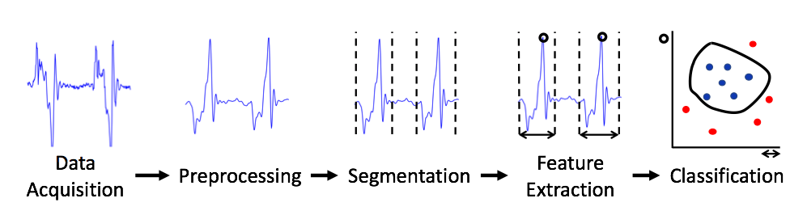

# Tutorial on Activity Recognition with Matlab

This tutorial teaches how to develop an activity recognition algorithm in Matlab. It provides several reusable abstractions to load process segment and process data using  signal processing and machine learning algorithms commonly used in wearable computing.


## Application
In this example application, we analyse the gait of a cow to detect lameness. We use a sample data set of a healthy cow and another data set from a lame cow. The code I provide segments the individual strides using a peak detector and trains a machine learning classifier to classify between normal and abnormal strides. 

## Setup
* install Matlab
* `git clone git@github.com:avenix/ARC-Tutorial.git`
* in Matlab, `addpath(genpath('./'))`
* in Matlab, run `main.m`.
* this code uses the mRMR library for feature selection. If you get an error 'estpab function not found', then you need to:
```
cd libraries/mRMR_0.9/mi/
mex -setup C++ 
makeosmex
```

	
*Note: if set a breakpoint and run the code line by line, then you can see the runtime values by hovering the mouse on top of the variables.*

## References
1. A toolkit to develop wearable device applications: https://github.com/avenix/WDK
2. Andreas Bulling's tutorial on activity recognition: https://dl.acm.org/citation.cfm?id=2499621
3. Wearable device applications:
    * https://www.mdpi.com/2414-4088/2/2/27
    * https://dl.acm.org/citation.cfm?id=3267267

## About
My name is Juan Haladjian. I developed this tutorial for my students at the Technical University of Munich. Feel free to contact me with questions or feature requests and to reuse and redistribute this software as you wish. The project is under an MIT license. You are welcome to use the code in this repository, extend it and redistribute it for any purpose, as long as you give credit for it by copying the *LICENSE.txt file* to any copy of this software.

Email: [haladjia@in.tum.de](mailto:haladjia@in.tum.de)

Website: [http://in.tum.de/~haladjia](http://in.tum.de/~haladjia)

